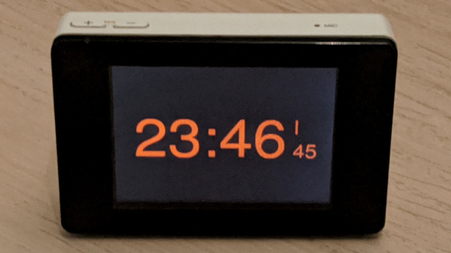

# swf
Flash Player will no longer be supported after December 2020

It is the time to celebrate it by writing something nice

## v1.0
Simple clock for Flash Lite device. 320x240, 2 fps, embedded sans font

Flash Lite 1.1: swf version 4, script version 5

## v2.0
Clock made from SpeedyCat flash animation. Both Flash Lite and Flash 5+ supported.

It can be [played in browsers](https://abalanonline.github.io/swf/) (tap F11) for one week until the timer hit EOL date.

Merry Christmas.
